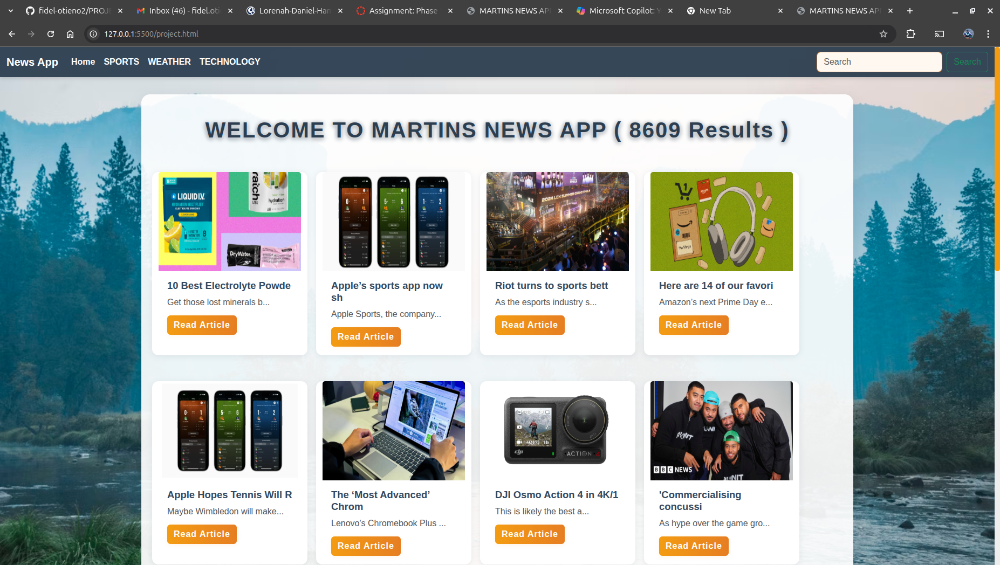
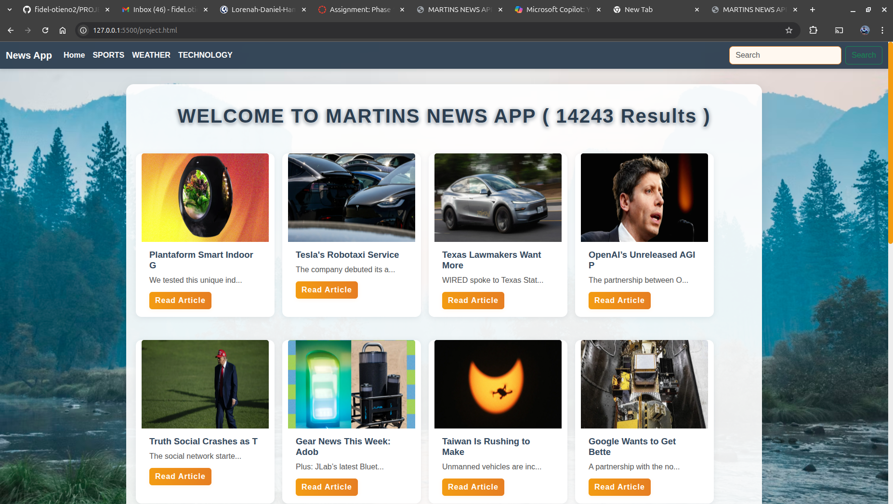

# PROJECT-1-PHASE-1-Simple-News-Website

# MARTINS NEWS APP

## 📖 Project Overview

**MARTINS NEWS APP** is a modern, responsive single-page web application that allows users to browse, search, and filter the latest news articles from around the world. Powered by the [NewsAPI](https://newsapi.org/), it provides a seamless news reading experience with category filters, search functionality, and pagination—all without page reloads.

### 🚩 Problem It Solves

Finding up-to-date news from multiple categories can be overwhelming. This app solves that by providing a clean, intuitive interface to access news by topic, search keywords, and navigate through results—all in one place and in real time.

---

## 🚀 Quick Setup & Usage

1. **Clone the repository:**
   ```bash
   git clone [text](https://github.com/fidel-otieno2/PROJECT-1-PHASE-1-Simple-News-Website.git)
   cd your-rep-name
   ```

2. **Open the app:**
   - Simply open `project.html` in your web browser.
   - No backend setup is required (all API calls are made from the frontend).

3. **Usage:**
   - Use the navigation bar to filter news by category (Home, Sports, Weather, Technology).
   - Use the search bar to find news on any topic.
   - Use the Previous/Next buttons to paginate through results.
   - Click "Read Article" to view the full story on the publisher’s site.

---

## 🗂️ Project Structure

```
PROJECT-1-PHASE-1-Simple-News-Website/
│
├── css/
│   └── style.css         # Custom styles for the app
├── project.html          # Main single-page application
├── project.js            # JavaScript logic for fetching and displaying news
└── README.md             # Project documentation
```

---

## 🤝 Contributing

Contributions are welcome! To contribute:

1. Fork the repository.
2. Create a new branch: `git checkout -b feature/your-feature`
3. Commit your changes: `git commit -m "Add your feature"`
4. Push to your fork: `git push origin feature/your-feature`
5. Open a Pull Request describing your changes.

---

## 👤 Author

- **Martins Fidel**  
  [GitHub Profile](git@github.com:fidel-otieno2/PROJECT-1-PHASE-1-Simple-News-Website.git)

---

## 📸 Screenshots

### Home Page  


### Sports Category  


### Search Results  


---

## 🌐 Live Demo

[View the Live Site on GitHub Pages]([text](https://github.com/fidel-otieno2/PROJECT-1-PHASE-1-Simple-News-Website.git))

---

## ⚖️ License

This project is licensed under the [MIT License](LICENSE).

&copy; 2025 Martins Fidel. All rights reserved.
