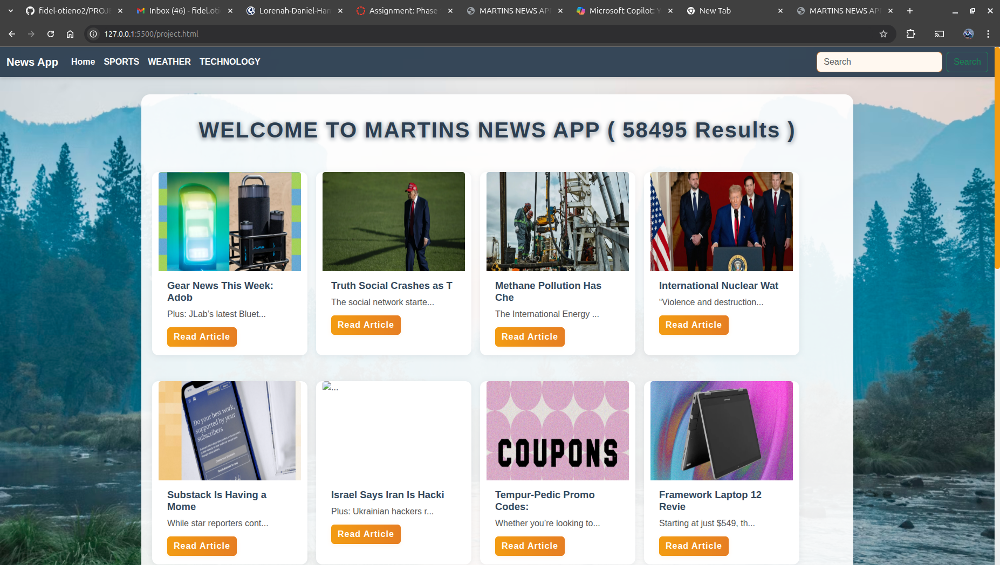

## PROJECT-1-PHASE-1-Simple-News-Website

# Martins News App

A modern, responsive news website that fetches **live news** from the [GNews API](https://gnews.io/).  
This project allows users to search for news, browse by category, and paginate through results—all from a beautiful, frontend-only interface.

---

##  What is this project?

Martins News App is a simple, stylish web application for browsing the latest news headlines.  
It solves the problem of quickly accessing and searching for current news on any topic, with a clean user experience and no backend setup required.

---

##  Quick Setup & Usage

1. **Clone or download this repository.**
2. **Open `index.html` in your browser.**
3. **(Optional) Change the GNews API key:**
   - Open `project.js`
   - Replace the value of `apiKey` with your own from [GNews](https://gnews.io/).

4. **Browse, search, and paginate live news instantly!**

---

##  Project Structure

```
/PROJECT-1-PHASE-1-Simple-News-Website
│
├── index.html         # Main HTML file
├── project.js         # All frontend logic (fetching, rendering, pagination)
├── css/
│   └── style.css      # Custom styles for a modern look
├── README.md          # This file
└── ...                # Other assets (images, etc.)
```

- **index.html**: The main page, includes navigation, search, and results area.
- **project.js**: Handles fetching news from GNews, rendering cards, and pagination logic.
- **css/style.css**: Contains all custom styles for layout, cards, navbar, and responsiveness.

---

##  Features

- **Live news** from GNews API
- Search any topic
- Quick category filters (Home, Sports, Weather, Technology)
- Pagination (10 results per page, with next/previous)
- Responsive, modern UI with cool styles
- No backend required

---

##  Screenshots



---

##  Contributing

Contributions are welcome!  
To contribute:
1. Fork this repository.
2. Create a new branch (`git checkout -b feature-branch`).
3. Make your changes.
4. Commit and push (`git commit -m "Add feature"`).
5. Open a Pull Request.

---

##  Authors

- **Martins Fidel** (Project Lead & Developer)

---

## License

This project is licensed under the MIT License.

---

##  Credits

- [GNews API](https://gnews.io/)
- [Bootstrap 5](https://getbootstrap.com/)
- Unsplash (for background images)